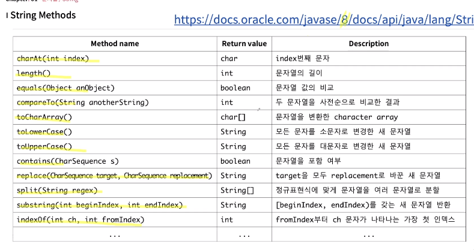

# 2024.01.05 TIL

## CS & Programming
### 소켓 및 다양한 통신방법(gRPC/socket/sse/polling)
최근에 소켓 얘기를 했었는데 오늘 우연히 도서관에서 리액트 소켓 프로그래밍이라는 책을 읽게 되면서 궁금해져서 알아봤다.
##### 분야
- 네트워크/통신/비동기 프로그래밍

##### 내용
- gRPC는 구글에서 만든 RPC를 발전시킨 통신방식으로 이기종(서로 다른 프로세스)와의 데이터 교환을 위해 주로 사용한다. 프로토콜 버퍼를 사용해 전송 데이터의 크기를 압축시키고 전송한다. 그리고 양방향 스트리밍이 가능하다. REST api처럼 다른 기종과 데이터 교환이 용이하도록 하는 하나의 규정이라고 할 수 있다.gRPC는 Protocol Buffers를 사용하여 효율적인 통신을 지원하며, 양방향 스트리밍 등의 기능을 제공한다. REST API는 간단하고 표준화된 HTTP 프로토콜을 사용하며, 대부분의 웹 애플리케이션에서 많이 사용된다.
- 실시간 통신이 가능하도록 하는 방식으로 POLLING, LONG POLLING, web socket, SSE의 방식을 사용할 수 있는데 먼저 POLLING은 클라이언트에서 서버의 변경사항이 있는지 주기적으로 확인하는 방식이다. 정확히는 실시간이라고 하기는 어렵지만 실시간처럼 보이게한다. LONG POLLING도 마찬가지인데 차이점은 POLLING의 방문 주기가 더 길다는 점이다. web socket은 서버와 클라이언트 간 소켓의 채널을 생성해 양방향 통신이 가능하게 한다. 다만 단점이 있다면 소켓의 연결은 자원을 그만큼 연결 유지에 사용한다는 점이 단점이다. sse는 양방향 통신이 아닌 단방향 통신이고, 서버에서 클라이언트에 요청을 할 수 있다. sse(Server-Sent Events) 의 경우 서버 > 클라이언트의 단방향이기 때문에 클라이언트에서 서버로 요청하지 않고 데이터를 받는 경우에 용이하다. 클라이언트의 데이터를 실시간으로 업데이트하는 방법이로 이처럼 여러가지 방법이 있다.
- 통신 프로토콜 중 UDP와 TCP의 차이로 UDP는 TCP보다 안전하지 않은 방식을 채택한다. UDP는 연결 지향적이지 않고, 데이터의 손실이 발생할 수 있지만, 일부 애플리케이션에서는 이러한 특성이 오히려 유용하게 사용되기도 한다. TCP는 신뢰성 있는 연결을 제공하지만, 일부 상황에서는 오버헤드가 발생할 수 있다.
- 다른 이용자들의 통신은 데이터링크 레이어(2계층)를 통한다.
- 7계층
    1. 물리 계층
    2. 데이터링크 계층
    3. 네트워크 계층
    4. 전송 계층
    5. 세션 계층
    6. 표현 계층
    7. 응용 계층
##### 의문점
- 그렇다면 골라주마는 어떤 방식을 사용하는게 적당할까?
- gRPC와 RPC에 대한 구체적인 내용을 파악하지 못했다.

## Projects
### 골라주마 ver.2
##### 작업내역
1. 대댓글 REQUEST, RESPONSE DTO를 만들었다.
2. 좋아요 RESPONSE DTO를 만들었다.
3. 대댓글 생성의 SERVICE레이러를 만들기 전, 기존 댓글 생성의 SERVICE로직을 수정했다. 먼저 투표가 완료된 경우, 투표의 소유자인 경우, 투표에 투표한 경우 댓글 생성이 가능하도록 하고 3개 전부다 아닌 경우에 오류를 방출하도록 했다.
##### Trouble Shooting
1. REQUEST DTO의 멤버변수로 익명성을 추가로 받고, entity또한 변경이 발생하면서 연쇄적으로 생성자의 매개변수의 변경, 엔티티로 변화시키는 toEntity함수의 매개변수 변경이 필요했다. 엔티티가 바뀌면서 4개의 dto들의 수정을 해야했다. 하지만 이렇게 여러 부분을 변화시키는게 유지보수성에 나쁜 점이었다고 생각했고, 부모의 생성자를 자식이 사용할 수 있으면 좋겠다고 생각했지만 자식은 부모의 디폴트 생성자를 활용하고, 사용자가 정의한 생성자를 사용하기 위해서는 자식 클래스의 생성자를 명시해야했다. 그래서 생성자를 그대로 두고 return type만 변경할 수 있는 방식을 찾아보려고 했지만 return type은 컴파일단계에서 결정되기 때문에 하나의 함수로 2개의 return type을 갖게할 수 없었다. 그렇기 때문에 converter를 생성해 관리할 경우, 각각의 dto의 수정사항을 converter에서 관리할 수 있다는 장점이 있겠구나라는 걸 몸소 느꼈다. 이전에는 데이터 변환은 dto의 책임이라고 생각했으나 dto는 데이터 전달 하나의 단일 책임으로 충분할 것 같다.

## Coding-test
안했음

## etc
### 문자열/string 관련 함수 모음
##### 분야
- Java 코딩 테스트
##### 내용

